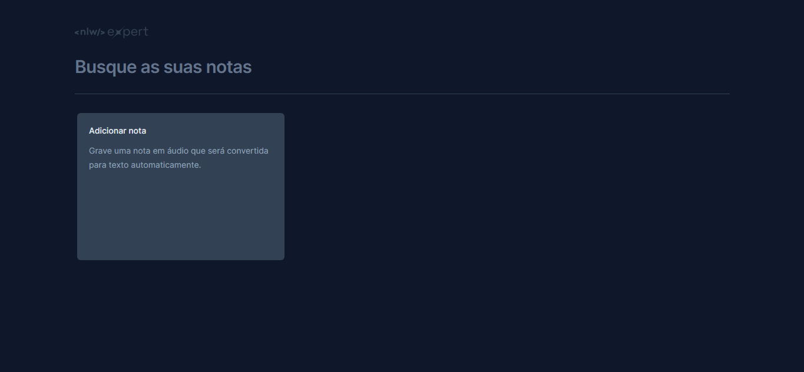
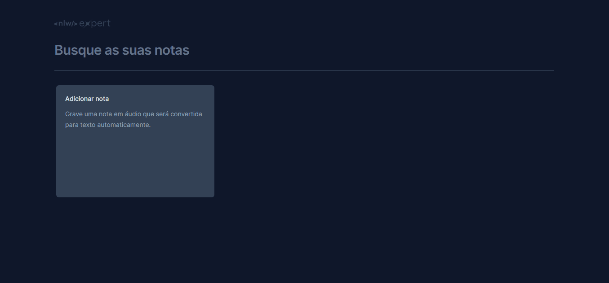

<h1 align="center"> Notas | NLW Expert </h1>

<p align="center">
Notas | NLW Expert é uma aplicação desenvolvida durante a NLW Expert, a primeira NLW da Rocketseat de 2024. O projeto é um bloco de notas que podem ser gravadas em áudio (caso o navegador suporte) ou digitadas, então elas ficam salvas em memória. <br/>
</p>

<p align="center">
  <a href="#-tecnologias">Tecnologias</a>&nbsp;&nbsp;&nbsp;|&nbsp;&nbsp;&nbsp;
  <a href="#-deploy">Deploy</a>&nbsp;&nbsp;&nbsp;|&nbsp;&nbsp;&nbsp;
  <a href="#-english-version">English Version</a>&nbsp;&nbsp;&nbsp;&nbsp;&nbsp;&nbsp;
</p>

<p align="center">
  
</p>

## 🚀 Tecnologias

Esse projeto foi desenvolvido com as seguintes tecnologias:

- React
- Typescript
- Speech Recognition API
- TailwindCSS
- PostCSS
- ViteJS
- RadixUI
- Sonner
- Lucide React

## 💻 Deploy

> [Clique aqui para navegar para o projeto!]()

<p align="center">
  
</p>


<!-- ## 💻 Rode Local
---
Para rodar o projeto localmente, basta cumprir as seguintes etapas:

1. Git clone
2. Git install
3. Npm start -->

## 🌎 English Version

Notas | NLW Expert is an application developed during the NLW Expert, the first Rocketseat's NLW of 2024. It is an notes app where the notes can be recorded through audio (if the browser supports it) or typed, then they are saved in memory. To do that, I've used:
- React, Typescript, Speech Recognition API, TailwindCSS, PostCSS, ViteJS, RadixUI, Sonner and Lucide React

> You can check out the deploy by [clicking here]() 

<!-- or run locally following these steps:
```
ETAPAS PARA RODAR LOCAL EM PROJETOS MAIS COMPLEXOS
``` -->

---
### Desenvolvido por Sarah Schneider 🖖